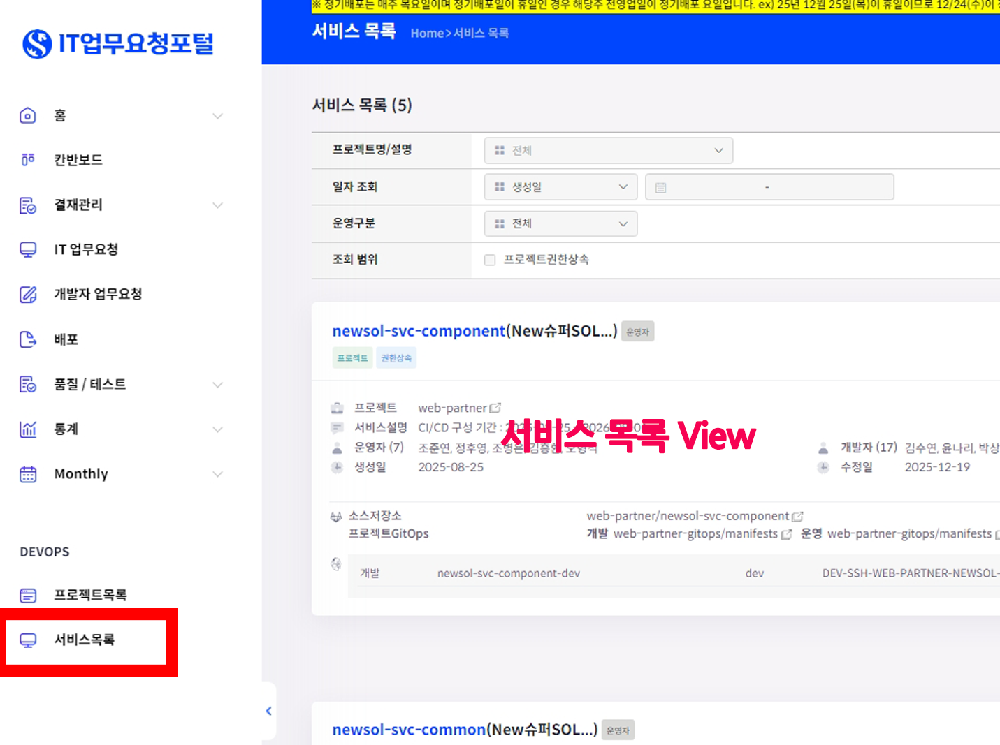
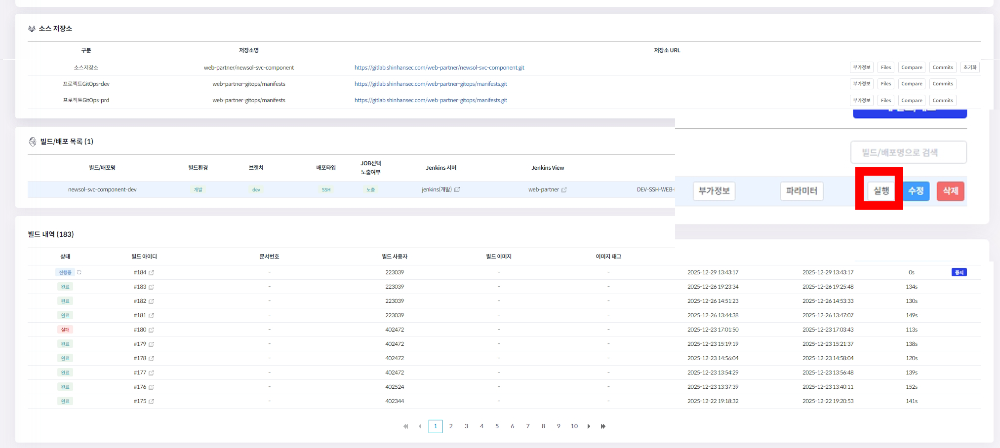
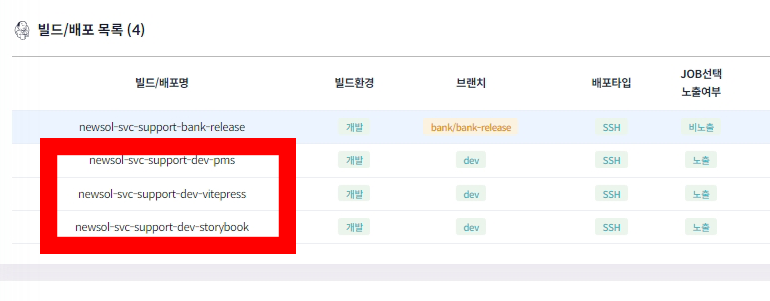
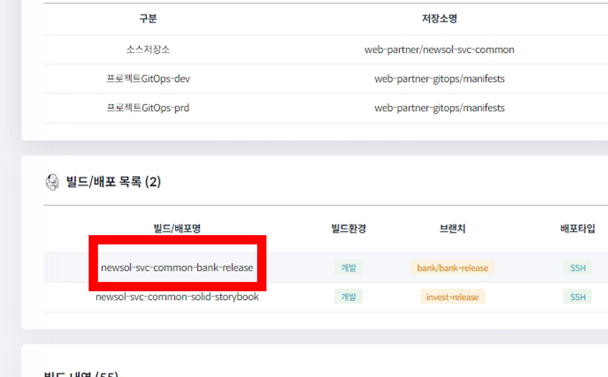

# 인수인계 문서

------

### 작성자: 정덕현

### 생성일: 2025.12.26

### UPDATE

| 업데이트 일자    | 수정자 | 내용                                                                               |
|------------|-----|----------------------------------------------------------------------------------|
| 2025.12.26 | 정덕현 | 최초 작성                                                                            |
| 2025.12.30 | 정덕현 | - newsol-svc-ui 공통 관리 <br/> - newsol-svc-ui 수정 및 필요 보완 사항 <br/> - storybook 보완사항 |

___________

## Management Points

해당 문서는 현재 공통 개발 영역에서 매니징 되는 포인트를 문서를 작성하여 현재 개발 진행 상황과 전체 흐름에 대한 설명 문서입니다.

----------------

## 목차

### [Repository Managements 정보](#Repository-Managements)

### [newsol-svc-ui repository](#newsol-svc-ui)

1. #### [newsol-svc-ui release 방법](#newsol-svc-ui-release)
2. #### [newsol-svc-ui code review 방법](#newsol-svc-ui-code-review)
3. #### [newsol-svc-ui 공통 관리](#newsol-svc-ui-common-management)
4. #### [newsol-svc-ui 수정 및 필요 보완 사항](#newsol-svc-ui-todo)

### [newsol-svc-component repository](#newsol-svc-component)

1. #### [배포 방법](#how-to-release-svc-components)
2. #### [sgp-ui 정보](#sgp-ui)
3. #### [sgp-common 정보](#sgp-common)

#### [newsol-svc-support repository](#newsol-svc-support)

1. #### [배포 방법](#how-to-release-support)
2. #### [pms 정보](#pms)
3. #### [storybook 정보](#storybook)
4. #### [vitepress 정보](#vitepress)
5. #### [storybook 보완사항](#storybook-todo)

#### [newsol-svc-common repository](#newsol-svc-common)

1. #### [강제 배포 방법](#how-to-direct-release-svc-common)
2. #### [mono-repo 설명](#svc-common-mono-repo)
3. #### [NP bridge md](#plugin-webview-bridge-md)

### [주기적으로 진행해야하는 작업](#주기적-작업-진행)
-----

-----

## Repository-Managements

공통 영역에서 관리하는 Repo 정보

#### 1. newsol-svc-ui

- 실제 업무개발을 진행하는 repository

#### 2. newsol-svc-component

- solid2.0을 재가공 하거나, 증권에서만 사용하는 라이브러리 모듈을 제작 후 배포하는 repository

#### 3. newsol-svc-support

- Storybook, Vitepress, PMSf를 관리하고 배포하는 repository

#### 4. newsol-svc-common

- 은행에서 만든 공통모듈인 Solid2.0, NP, App-common 등을 미러링 후 배포 하는 repository

-------

-------

## newsol-svc-ui

업무 개발자들이 실제로 화면 개발을 진행하는 repository 입니다.

----------------

### newsol-svc-ui release

#### SVC-UI Release에 대해 설명합니다. <br/> svc-ui는 매주 월요일까지 업무 개발자분들이 router를 타는 조건 기준으로 배포 가능한 목록을 취합 후 매주 화요일에 해당 내용으로 배포를 진행합니다.

- 각 개발자들은 현재 done에 올라가있는 이슈 티켓을 closed로 모두 이동시키도록 협조 요청을 진행합니다. <br/> **(dev 반영 시기에는 done에는 아무것도 없어야합니다.)**
- 각 개발자들에게 router에 등록된 **화면명, 화면 경로, 화면ID**를 받아 취합 조건을 충족합니다.
- 각 개발자들에게 받은 해당 정보를 si.json에 등록합니다.
- si.json 을 등록하고, staging-dev를 dev 브랜치로 MR을
  진행합니다 [git-mr](https://gitlab.shinhansec.com/web-partner/newsol-svc-ui/-/merge_requests/new)
- MR을 진행할 때에 [git-sample](https://gitlab.shinhansec.com/web-partner/newsol-svc-ui/-/merge_requests/440) 등의 내용을 기입하여 배포
  정보를 정리합니다.
- MR이 완료 된 이후 해당 dev git commit 이력에 tagging을 추가합니다 **sol-v#.#_yyyy.mm.dd** 로 태깅을 진행 후 tagging 정보를 push 합니다.
- tagging push 완료 [git-release](https://gitlab.shinhansec.com/web-partner/newsol-svc-ui/-/releases)에서 new-release를 생성하여,
  현재 tagging 을 release를 마무리합니다.
- release가 완료되면 Issues 탭에 milestones을 close 하고, close 후 신규 milestones을 차주 화요일까지로 milestones 신규 생성합니다.
- 현재 있는 ticket들을 모두 새 milestones로 이동합니다.
- 마지막으로 모든 티켓 정리가 완료되면 현재 git origin에서 feat/하단에 있는 브랜치들을 모두 삭제합니다. 또한 개발자들이 잘못 생성한 브랜치 정보도 모두 삭제합니다.

-----

### newsol-svc-ui code review

#### 1. !!필독 내용!!

- svc-ui repo내에 **legacy**는 ```shinhan/ui```를 사용하며 **sol_v3**의 경우 ```shinhan/solid-vue-ui```를 사용합니다. 그 외 assets과 router는
  공용 사용을 진행합니다.
- **sol_v3**는 shinhan/shared와 biz-common을 사용할 수 없으므로 `@shinhansec/sgp-common`으로 별도 생성을 하였습니다.<br/> (해당
  내용은 [vitepress](https://sgp-web-test.shinhansec.com/vitepress/dev/chapter5/utils.html) 참조하시면됩니다.)
- 코드리뷰는 sol_v3내에 경로와 router만 확인합니다.

```
  svc-ui/
  ├── src/
  │   ├── assets/
  │   ├── legacy/
  │   ├── router/
  └── └── sol_v3/
```

____

#### 2. 확인 범위

- 코드리뷰시 v-for에서 key값은 index가 아닌 난수화가 진행되어야합니다. `import {v4 as uuid} from "uuid"`가 가능하도록 설치를 해놓았으므로, 해당 부분 코드에서 uuid를
  사용했는지 확인 부탁드립니다. 또한 태그내에서 직접적으로 uuid를 사용한 경우에도 코드리뷰 대상이 됩니다.
- wave 확인 여부는 코드 리뷰 요청이 온다면 그때 한번 담당 개발자에게 wave로 접근성 확인 하였는지 선 질의 부탁드립니다.
- Java처럼 for문을 썼다면 대부분 comment 대상입니다
- vue 파일은 첫글자는 대문자입니다.
- ts 파일은 camel Case를 규칙으로 합니다.
- 모든 ref, reactive등 변수는 타입을 가지며 any는 왠만하면 사용하지 않습니다
- ref나 watch가 쓸데없이 많을 경우 comment 대상입니다.
- vitepress에 기재되어있는 기능들이 있는데 별도로 사용했다면 comment 대상입니다.
- ts에서는 data들을 모으거나 sever action등을 정의하도록 하고, vue에서는 대부분 결과물 기준으로만 불러오는 형태를 기준으로 합니다.
- solid2.0을 사용하는 sol_v3에서 `shinhan/shared`를 사용하였다면 comment대상입니다
- 코드리뷰시 타인이 만들어서 올린 파일이 같이 올라가 mr에 요청 되었는지 업무개발자에게 한번 더 확인요청을 진행합니다.
- 타입 선언 잘 되어있는지 확인합니다
- jsDoc이 제대로 작성 되어 있는지 확인합니다.

-----

#### 3. 코드리뷰 방법

- [gitlab](https://gitlab.shinhansec.com/web-partner/newsol-svc-ui/-/issues?sort=created_date&state=opened)에 접속 후 Issues
  팁에서 Borads를 확인합니다.
- boards에서 각 개발자가 요청한 이슈티켓 타이틀을 확인합니다
- 해당 타이틀 진입 후 하단에 `Related merge requests` 영역에 묶여있는 MR 정보를 클릭하여 MR링크로 넘어갑니다.
- Changes Tab에서 코드 변경 이력을 확인 후 문제성 라인을 클릭하여 comment를 작성 후 `start a review`로 저장합니다.
- 모든 vue 혹은 ts를 확인하였다면 맨 하단에 `Submit revivew`를 눌러 개발자분에게 comment 확인을 요청하여주세요
- Comment 작성 완료 후 업무개발자가 수정완료 하였다면 재 리뷰 후 다시 Overview tab에서 Approve 한 후 Merge를 진행합니다
- Merge를 진행할때 **Delete source branch** 를 반드시 체크 후 진행 해주세요
- [x] **Delete source branch**
- 완료 되면 staging-dev에 머지가 되며 해당 업무 개발자에게 issues ticket을 정리를 요청하여주세요

----

### newsol-svc-ui-common-management

#### ---2025.12.30 추가내용---

`newsol-svc-ui` repository는 퍼블팀에서 직접관리하지 않음으로 반드시 `newsol-svc-support` repository 내에 있는 `resource` 하단에 있는 이미지들과 scss
정보들을 직접 가져와야합니다.
<br/>
images는 `public/images/sol_v3` 하단으로 주입하고, scss는 `src/assets/styles/sol_v3` 하단으로 주입합니다.
<br/>
주의할 점은 scss내에 이미지 경로가 상이함으로 반드시 image 경로를 `newsol-svc-ui` 기준으로 재작업해서 진행해야합니다.

-----

### newsol-svc-ui-todo

#### ---2025.12.30 추가내용---

- **useStockSteam**: 단건을 기준으로 주식 종목 상세 정보를 불러옵니다. 소켓 통신으로 실시간 통신을 진행합니다.
    - 실시간 정보를 가져올 때 호가와 관련 된 부분이 존재합니다 KRX 일 경우 장외시간과 NXT 정보를 체크하여 조건이 `KRX && 장외시간 && NXT` 일 경우 호가를 불러오는 정보시스템이 장외로
      달라져야하는 로직이 존재합니다.
      <br/>
      해당 부분은 서버에서 서버시간을 받아와서(KST로 내려줌 UTC아님) 실시간 정보를 체크 후 진행해야하는 부분이있는데, 이부분에서 문제는 사용자의 기기가 저전력 모드일 땐 setInterval이 정상작동을
      하지 않으며, VPN으로 해외로 속할 경우에는 클라이언트 시간과 상이합니다.
      <br/>
      그러므로 위 내용들을 고려하여 서버시간을 체크 && KRX 여부 && 장외시간 && NXT 를 위와 같은 문제점을 피해서 보완하는 코드가 필요합니다. useKRXSession등으로 일부만들어 놓았으나
      완전히 제작하지 않으므로 작성합니다.
- **useStockSteamList**: 다건으로 종목 테마별 주식 시세 정보를 불러옵니다. 소켓 통신으로 실시간 통신을 진행합니다.
- **useWebSocket**: 실시간 소켓 통신 connect / disconnect 역할을 하는 composable입니다.
- **useStockRealtimeCore**: socket을 통해 받아온 정보를 가공하여 실시간 정보를 파싱하는 composable 입니다.
- **Trading View Chart**: 현업이 이미 만들어서 chart로 제공하지만 현업에서 store를 너무 많이 사용하고 있습니다. 분명 추후에 정보들이 추가 되면 이부분은 문제가 될 수 있기 때문에
  실시간 소켓만으로 공통 모듈로 제작을 권장합니다.
  <br/> 또한 헤딩 부분에서 2차에서 진행 될 정보이지만, 각 라인의 색상을 지정하거나 할 수 있어야함으로 이부분 좀 고도화 개발이 필요합니다.
- **store information**: 가제로 store information라고 적어놓았지만, 사용자가 마지막으로 선택한 tab값 이라던가, recents 등 여러 마지막 정보를 저장해야하는 경우들이
  종종있습니다 이에 경우 신한의 경우 super sol 자체가 기기 + 유저 기준이 아니기 때문에 어떤 유저들 한대에 기기에서 여러명이 로그인 로그아웃으로 접속할 수 있습니다.
  <br/>
  그러므로 사용자 정보를 last info 들의 경우는 localStorage에 유저정보는 sessionStorage에 저장을 원칙으로 하며, 유저가 달라질 경우 localStorage 정보를 초기화 힙나디.
  <br/>
  지금은 store 정보내에 guard를 localStorage, sessionStorage로 지정해놓았으나 고도화하여 locweb이 아닐 경우에는 localStorage = SHPPreference ,
  sessionStorge = SHPGlobalStorage 로 변경 저장 부탁드립니다.
- **ci images**: stock 종목 별 ci 이미지를 가져오는 로직이 ciImage.js 라고 존재합니다. 해당 부분 코드를 분석하여 image를 stockSteam 혹은 stockSteamList에
  추가로 삽입해야합니다.
- **office logo**: office logo(가제)는 public/images/sol_v3/ 하단에 icons라고 보면 088.svg 등으로 제가 코드값으로 은행, 증권사등의 로고를 등록해놓았습니다. 아직
  보험사나 부족한 로고들이 있어서 이부분을 추가 보완 해야합니다.

---

---

## newsol-svc-component

newsol-svc-component는 증권내에서 사용하는 components와 utils를 모아서 배포하기 위해 만든 repositorty로 mono repo 형태로 구성 됩니다.

```
  newsol-svc-component/
  ├── packages/
  │   ├── config/ <= eslint, ts 설정
  │   ├── sgp-common/ <= sgp-common 모듈
  │   ├── sgp-ui/ <- sgp-ui 모듈
  ├── public/ <- 이미지 등 공개가능 정보에 대한 경로
  ├── release-notes/ <- 릴리즈 노트 작성 경로
  ├── scripts/ <= 사용하지 않지만 우선은 둡니다.
  └── sec-packages/ <= pnpm build -> pnpm pack-package 하면 tgz가 생성되는 경로
        └── sec-lib/
```

----

### how to release svc components

1. svc-components dev에 최신 코드 push 반영.
2. 업무망 pc 접근
3. [IT업무요청포털](https://devopsportal.shinhansec.com) 로그인
4. 왼쪽 서브 메뉴 탭 DEVOPS > 서비스 목록 클릭
   
5. 상세 페이지에서 dev 브랜치 정보 줄에 실행 버튼 클릭.
   
6. 배포 실행 confirm이 나타나며 확인을 누른 후 몇 초후 toast 빌드 실행한다는 toast 팝업이 나타납니다.
7. 그 후 빌드내역 섹션에서 refresh를 하면 진행중 표시가 나타납니다.
8. 상세 로그는 [젠킨스]((https://jenkins-dev.shinhansec.com/job/DEV-SSH-WEB-PARTNER-NEWSOL-SVC-COMPONENT/))내에서 확인 가능합니다.
9. 배포가 완료 되면 상태가 완료로 변경 되며 에러가 날 경우 실패가 표시됩니다.
10. 실패 내역은 빌드 내역 row를 클릭하여 확인하거나 젠킨스 내에서 확인 가능합니다.

----

### sgp-ui

- #### 역할
  `@shinhansec/sgp-ui`모듈을 생성하는 repo 입니다. 이곳에서 퍼블리셔가 만든 공통 컴포넌트를 증권 전용 컴포넌트로 재 가공하고, 기능을 최대한 확장성 있게 추가하여 개발 편의성을 높입니다.
  svc-support storybook에서 테스트 진행 후 완료된 건을 기준으로 공통 components를 제작합니다.
  제작 완료 한 후 반드시 **package.json**의 버전을 올려야합니다.
- #### 배포 및 개발 방법
    1. sgp-ui/src/ 하단에 components 혹은 composables, utils, types등을 생성합니다.
    2. 각 components, composables, utils, types 등에 있는 index.ts에 반드시 최근 생성한 정보를 주입합니다.
    3. `newsol-svc-supoort/resouces/assets/styles/base/_components.scss`등이 변경 되면
       `newsol-svc-component/packages/sgp-ui/src/assets/styles/base`등에 맞는 경로에 똑같이 업데이트를 진행합니다.<br/>
       이미지 url이 들어갈 경우에는 `url(#{$base-path}/images/sol_v3/COM/icon_exchange.svg)` 이런식으로 `${bash-path}`를 추가하여 svc-ui에서 직접
       경로를 받아올 수 있도록 반영해야합니다.
    4. package.json 버전을 올린 후 `pnpm build`를 실행하여 정상 build를 체크합니다.
    5. build 완료 후 dev에 머지하고 위에 릴리즈 방식을 따라 배포를 진행합니다.
    6. 릴리즈 완료 후에는 개발 전체 단톡방에 내용을 전달하여 개발자들이 업데이트 할 수 있도록 유도합니다.

----

### sgp-common

- #### 역할

sgp-common은 증권에서 사용하는 기능 라이브러리 모듈 입니다. 패키지는  `@shinhansec/sgp-common`으로 배포 됩니다.
sgp-common의 경우 shinhan/shared, shinhan/biz-common에서 사용하던 모듈을 바탕으로 증구너 라이브러리로 재작업하여 제작 되었으며,
np 브릿지가 직접 web에서는 작용하지 못하는 부분으로 인해 증권내에서 local개발 로직과 분리하여 개발 편의성을 증대한 모듈 입니다.
또한, meta.ts에 서버에 등록된 최신 정보 또한 배포하는 작업을 진행합니다.

- #### 개발 방법 및 배포
    1. **meta.ts**<br/>
       서버 개발자가 swagger에 신규 api를 등록할
       경우 [meta 생성기](https://swat.shinhansec.com/static/html/utility/generate-code-meta.html?1766986565800)를 통해 신규 메타를
       추가
       생성합니다.
       <br/> 생성 방법은 `packages/sgp-common/constants/meta.ts`파일의 내용을 모두 복사 후 meta 생성기 화면에서 AS-IS 섹션에 붙혀넣습니다. <br/>
       그 이후 업데이트 버튼을 클릭하면 TO-BE에서 최신 메타가 가장 아래 추가됩니다. 그 이후 해당 내용을 다시 meta.ts 복사 붙혀 넣기합니다.
        1. meta.ts 변경이 완료되면 `packages/sgp-common/package.json` 에 version을 업데이트합니다.
        2. dev에 해당 내용을 반영하고  [배포하기](#how-to-release-svc-components)내용에 따라 배포를 실행합니다.
    2. **utils 및 기타 배포**
       추가적으로 공통에서 말아서 내려야하는 기능이 있을 경우 utils나 composables등 생성 후 위와 동일하게 배포를 진행합니다.

-----

## newsol-svc-support

svc-support는 업무 개발자가 개발에 활용할 수 있도록 각 모듈의 정보나 컴포넌트의 사용법 혹은 화면 퍼블리싱을 확인하기 위해 있는 repository입니다.

- pms: 퍼블팀에서 각 화면을 퍼블리싱하여 배포하는 곳
- vitepress: 공통 기능 혹은 개발 관련 문서를 공통에서 정의하여 개발자들에게 배포하는 곳
- storybook: 공통 컴포넌트를 테스트 할 수 있도록 playground 개념 및 정보를 제공하는 곳

```
  newsol-svc-support/
  ├── apps/
  │   ├── @pms/ <= pms app
  │   ├── @storybook/ <= storybook app
  │   ├── @vitepress/ <- vitepress app
  ├── packages/
  │   ├── config/ <= eslint, tslint 설정
  │   ├── sgp-common/ <= sgp-common 테스트를 위한 패키징 
  │   ├── sgp-ui/ <= sgp-ui components를 storybook에 테스트할 수 있도록 하는 packages
  ├── resouces/ <- storybook, pms, vitepress등 모든 resource를 여기서 확인합니다.
  ├── public/ <- 이미지 등 공개가능 정보에 대한 경로
  ├── release-notes/ <- 릴리즈 노트 작성 경로
  ├── scripts/ <= 사용하지 않지만 우선은 둡니다.
  └── sec-packages/ <= pnpm build -> pnpm pack-package 하면 tgz가 생성되는 경로
        └── sec-lib/
```

----

### how to release support

- svc-support 배포는 기준은 퍼블의 dev 브랜치는 pub 입니다. <br/> 대부분의 기능은 pub에 최신 정보와 알치해야함으로 pub를 stagign-dev 접점으로 고려 한 후 브랜치를 생성합니다.
- svc-support는 `newsol-svc-support-dev-pms`,`newsol-svc-support-dev-vitepress`,`newsol-svc-support-dev-storybook` 3가지가
  있으나 pms는 퍼블팀에서 배포를 진행하며 개발팀의 경우는 storybook과 vitepress만
  배포합니다.  
- svc-support는 우선 dev에 push가 되면 자동으로 젠킨스가 실행 됩니다 배포 정보는 아래 젠킨스 정보에서 확인 가능합니다.
    - [pms 젠킨스](https://jenkins-dev.shinhansec.com/job/DEV-SSH-WEB-PARTNER-NEWSOL-SVC-SUPPORT-PMS/)
    - [vitepress 젠킨스](https://jenkins-dev.shinhansec.com/job/DEV-SSH-WEB-PARTNER-NEWSOL-SVC-SUPPORT-VITEPRESS/)
    - [storybook 젠킨스](https://jenkins-dev.shinhansec.com/job/DEV-SSH-WEB-PARTNER-NEWSOL-SVC-SUPPORT-STORYBOOK/)

### pms

#### 실행: `pnpm dev:pms` or `pnpm dev`

#### localhost: `localhost:5173/pms/`

#### dev: `https://sgp-web-test.shinhansec.com/pms/@pms`

pms는 아래와 같은 폴더 구조를 유지하며 대부분 퍼블팀에서 작업을 하고 관리하나 가끔 개발 설정 문제등은 공통에서 확인해주고 있습니다.

```
  newsol-svc-support/
  ├── apps/
  │   ├── @pms/ <= pms app
  │   │   ├── service
  │   │   ├── src
  │   │   │   ├── components <= pms 화면 구성 정보는 대부분 여기 있습니다.
  └── └── └── └── composables <= pms 화면 router 구성 정보는 대부분 여기 있습니다.  
```

### storybook

#### 실행: `pnpm dev:storybook` or `pnpm dev`

#### localhost: `localhost:6007`

#### dev: `https://sgp-web-test.shinhansec.com/storybook/`

storybook은 packages/sgp-ui를 바라보며 거기서 생성 된 컴포넌트들이 여기에서는 `@shinhansec/sgp-ui`로 사용가능합니다.<br/>
진행시 반드시 packages 밑에 정보들이 빌드 되어야하며 해당 기능은 `pnpm dev` 실행시 같이 동작합니다.

```
  newsol-svc-support/
  ├── apps/
  │   ├── @storybook/ <= storybook app
  │   │   ├── .storybook <= storybook 설정
  └── └── └── stories <= story 화면들 추가  
```

### vitepress

#### 실행: `pnpm dev:vitepress` or `pnpm dev`

#### localhost: `localhost:5175/vitepress

#### dev: `https://sgp-web-test.shinhansec.com/vitepress/dev/`

vitepress는 `@shinhansec/sgp-common` 혹은 `newsol-svc-common`내에 있는 `@shinhan/plugin-webview-bridge` 모듈의 md 파일을 관리합니다.
모듈을 새로 만들거나 환경 설정의 정보를 저장할 때 해당 문서를 업데이트 합니다. <br/>
특히나 `newsol-svc-common`내에 있는 `@shinhan/plugin-webview-bridge` 모듈은 계속 개발 진행 중임으로 주기적인 업데이트가 필요합니다.

```
  newsol-svc-support/
  ├── apps/
  │   ├── @vitepress/ <= vitepress app
  │   │   ├── .vitpress <= vitepress 설정
  │   │   │    └── sidebar-dev.ts <= vitepress 왼쪽 사이드바 메뉴 리스트
  └── └── └── docs <= docs md 파일들 추가  
```

### storybook-todo

#### ---2025.12.30 추가내용---

- 현재 storybook에 화면 개발자들이 사용해야하는 컴포넌트들 중 버그가 몇가지가 존재합니다 해당 부분 요청 받아 수정을 진행해야합니다.
- **useDrawer, usePopup**: zod, vee-validation 을 이용하여 form으로 데이터 묶을 있도록 추가 가공 필요 (버튼이 외부에 있어서 해당 부분을 가공해야합니다.)
- **solid2.0 사용여부 체크**: solid2.0을 사용하지 않고 만든 모듈들이 몇가지가 존재합니다 해당 부분 수정 후 재 배포해야합니다.
- **storybook stories 보완**: 설명이나 args 값이 부족한 경우가 많습니다 해당 부분 수정 필요합니다 또한, 공통으로 묶이지 말아야하거나 굳이 공통이 아닌 컴포넌트들이 있습니다 업무개발자들에게
  양해를 구한 후 재작업이 필요한 모듈들이 꽤 존재합니다. <br/> 그대로 유지하면 증권 전용 쓰레기 컴포넌트가 되어버려서 해당 부분 반드시 수정이 필요합니다.

---

---

## newsol-svc-common

newsol-svc-common은 은행에서 만든 `@shinhan/solid-vue-ui`, `@shinhan/app-common`, `@shinhan/plugin-webview-bridge`를 미러링 하여 증권
nexus에 배포를 진행합니다 <br/>
[증권 nexus](https://nexus.shinhansec.com/#browse/browse:npm-public:%40shinhan)에서 `@shinhan/*` 모듈과 `@shinhansec/*` 모듈들의 최신
버전을 확인 가능합니다.

```
  newsol-svc-common/
  ├── apps/
  ├── packages/ <= solid-vue-ui, app-common, plugin-webview-bridge
  ├── public/
  └── scripts/
```

### how-to-direct-release-svc-common

svc-common 미러링은 매일 오전 7시경 진행 되지만, 만약 solid2.0 업데이트 등이 hotfix로 급하게 이루어질 경우 [IT업무 포탈에서](#how-to-release-svc-components)
svc-components 배포 방법과 동일하게 상세 페이지에서 빌드를 진행합니다.<br/>
진행시 `newsol-svc-commmon-bank-release` 를 `실행`해야하며, 실행 뒤에는 ci/cd로 자동 미러링 진행 후 배포 됩니다.


-----

### svc-common-mono-repo

```
  newsol-svc-common/
  ├── apps/
  ├── packages/ <= solid-vue-ui, app-common, plugin-webview-bridge
  ├── public/
  └── scripts/
```

형태를 기본적으로 가지고 있습니다.

----

### plugin-webview-bridge md

해당 내용 MD 내용을 `newsol-svc-support` vitepress에 업데이트를 합니다.

```
  newsol-svc-common/
  ├── apps/
  ├── packages/ <= solid-vue-ui, app-common, plugin-webview-bridge
  │    ├── plugin-webview-bridge
  │    │    ├── src
  │    │    │   ├── NPBridges
  └──  └──  └── └──  └── bridge <= md 위치
```

---

---

## 주기적 작업 진행

루틴적으로 계속해서 지속되는 작업 정보를 작성 드립니다.

### 1. svc-ui 배포

- 매주 월요일: 업무 개발자분들이 si.json 기준 배포하는 목록 기준을 월요일 18시 이전까지 취합 합니다.
- 매주 화요일: 월요일 기준 배포 목록을 정리하여 si.json에 등록하고 [svc-ui-release](#newsol-svc-ui-release) 절차에 따라 배포를 진행합니다.

### 2. svc-component 배포

- 공통 component를 추가, 수정 등을 진행하거나 utils정보 혹은 meta 정보가 추가 수정 되는 경우 계속 반영을 지속해야합니다.

### 3. svc-support 배포

- pms 화면 중 공통 컴포넌트가 확인 되면 추가적으로 storybook을 업데이트를 진행하고, webview-bridge가 업데이트 될 경우나 utils가 추가 될 경우 주기적으로 vitepress를 업데이트
  진행합니다.

### 4. svc-ui code review

- 위 문서에 [코드리뷰](#newsol-svc-ui-code-review) 방법론에 따라 코드리뷰를 진행하고 컨펌 합니다.

### 5. svc-common

- 위 문서에 적혀있듯이 hotfix 배포는 직접 미러링 후 배포 진행해야합니다.


